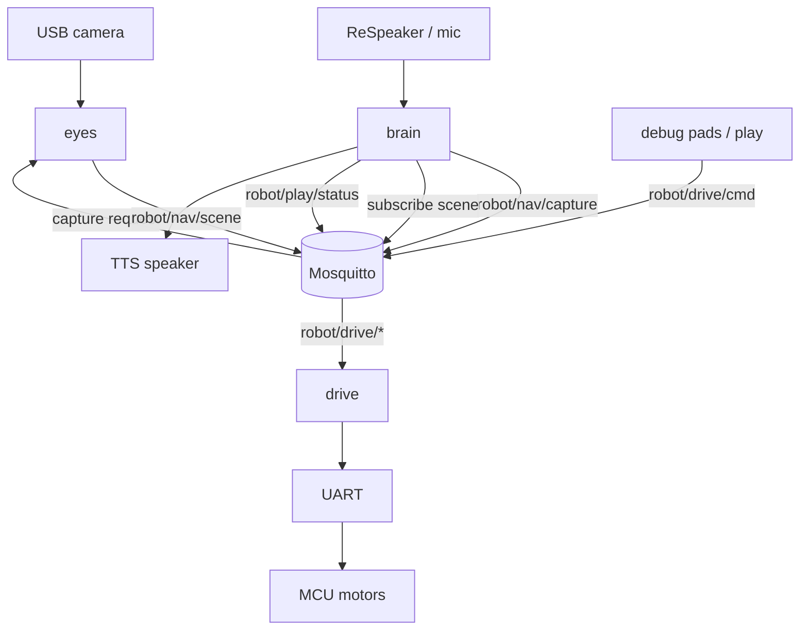

# Architecture

Puppet is split into processes that share one MQTT bus. Each owns a hardware or product concern so they can restart and scale GPU/CPU independently on the Jetson.

## Body map

```text
  eyes     see the room          → capture on request; publish robot/nav/scene
  drive    move the base         → robot/drive/cmd|stop|status
  brain    talk with the child   → request capture; inject Vision: into Gemma; play follow/seek
```



## Responsibilities

### eyes
- Keep a live camera preview (debug UI).
- On **manual Capture** (debug web) or **`robot/nav/capture`** (MQTT), run one YOLO + Depth Anything V2 Metric + Fast-SCNN pass.
- Fuse into a traversability mask, BEV costmap, and a short `hint`.
- Publish JSON on `robot/nav/scene` (echoes `req_id` when the capture was requested over MQTT).
- Debug UI: `eyes/debug_web` (camera / boxes / traverse + Capture + drive pad + brain/drive logs).

### drive
- Host MQTT bridge → UART protocol.
- Firmware owns FIFO, watchdog TTL, and estop latch.
- Debug UI: `drive/debug_web` (or the pad embedded in eyes).

### brain
- Voice orchestrator (Parakeet STT, llama.cpp Gemma, Piper TTS).
- When `mqtt.vision_enabled` is true, owns the vision loop: injects cached `CameraJSON` into the LLM system prompt. Gemma may emit `<<look>>` to request a fresh `robot/nav/capture`. `capture_before_reply: true` still captures before every reply. Object labels are English and must be translated to the spoken language.
- With ReSpeaker `face_speaker: true`, latches DoA while the child speaks and publishes a one-shot `turn_left`/`turn_right` on `robot/drive/cmd` so the chassis faces them (~60° DoA = front).
- With `play.enabled`, runs a background **play supervisor**. Gemma starts follow / hide-and-seek by emitting hidden `<<follow>>` / `<<seek>>` / `<<stop>>` tags (or via `robot/play/cmd`). The supervisor repeatedly captures a scene and publishes short `dur>0` drive nudges. See [movement.md](movement.md).

Realtime traffic is **MQTT** (Mosquitto). Modules do not call each other over HTTP in production.

## Typical bring-up order

1. `mosquitto` (system service).
2. `drive` host bridge (MCU on UART) — **must be up before eyes/brain**.
3. `eyes` debug web (listens for `robot/nav/capture`; Capture button also works).
4. `brain` (`puppet --config config/`) — talks with the child; Gemma tags start look / follow / seek.

On the Jetson, [systemd.md](systemd.md) installs this order as `puppet.target` (`puppet-drive` starts first).

## Out of scope (later steps)

See [movement.md](movement.md) for the play roadmap. Not in step 1:

- Costmap A* / DWA local planner
- Robot-hides (no map / no “go to a corner” yet)
- ADE / indoor-trained floor segmentation (Cityscapes Fast-SCNN is a stopgap)

## Build ingredients (not products)

Top-level trees such as `llama-cpp/`, `parakeet-cpp/`, `whisper-cpp/`, `tts/`, `PrismML-Eng/` are vendor/build sources used by **brain**. Prefer treating them as deps, not peer modules.
