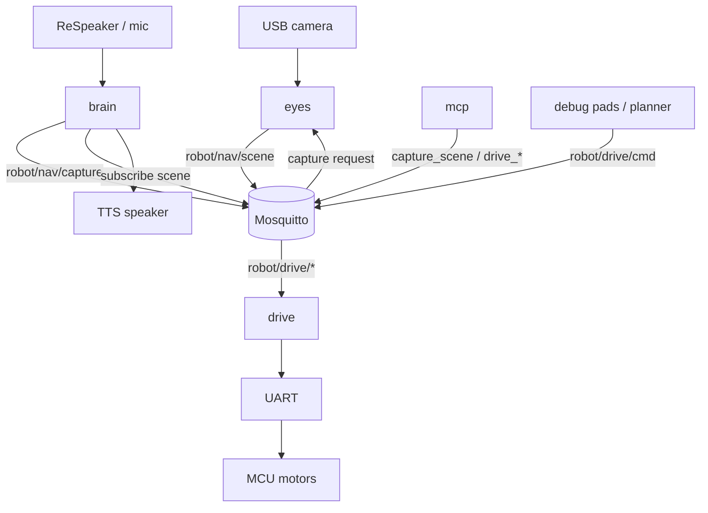

# Architecture

Puppet is split into processes that share one MQTT bus. Each owns a hardware or product concern so they can restart and scale GPU/CPU independently on the Jetson.

## Body map

```text
  eyes     see the room          → capture on request; publish robot/nav/scene
  drive    move the base         → robot/drive/cmd|stop|status
  brain    talk with the child   → request capture; inject Vision: into Gemma
  mcp      tool facade for brain → same MQTT (optional motion gate)
```



## Responsibilities

### eyes
- Keep a live camera preview (debug UI).
- On **manual Capture** (debug web) or **`robot/nav/capture`** (MQTT), run one YOLO + Depth Anything V2 Metric + Fast-SCNN pass.
- Fuse into a traversability mask, BEV costmap, and a short `hint`.
- Publish JSON on `robot/nav/scene` (echoes `req_id` when the capture was requested over MQTT).
- Debug UI: `eyes/debug_web` (camera / boxes / traverse + Capture + drive pad).

### drive
- Host MQTT bridge → UART protocol.
- Firmware owns FIFO, watchdog TTL, and estop latch.
- Debug UI: `drive/debug_web` (or the pad embedded in eyes).

### brain
- Voice orchestrator (Parakeet STT, llama.cpp Gemma, Piper TTS).
- When `mqtt.vision_enabled` is true, owns the vision loop: if the user prompt needs seeing (or `capture_before_reply` is true), publishes `robot/nav/capture`, waits for `robot/nav/scene`, and appends `CameraJSON` to the LLM system prompt. Object labels are English and must be translated to the spoken language.
- Uses the **same MQTT capture contract** as MCP tools (brain does not need Cursor).
- Does **not** command motors yet (persona says it cannot drive alone).

### mcp
- Tool facade over MQTT for the **on-robot agent** (brain / future Gemma tool-calling).
- Tools: `capture_scene`, `get_scene`, `get_drive_status`, `drive_stop`, `drive_clear`, `drive_cmd` (motion gated by `ROBOT_MCP_ALLOW_MOTION=1`).
- `capture_scene` publishes `robot/nav/capture` and returns the matching scene — same path brain uses.
- Never replaces Mosquitto; publishers remain eyes and drive. Cursor is for developing software only, not the runtime host.

## MQTT vs MCP

| Layer | Role |
|-------|------|
| **MQTT** | Realtime bus between eyes, drive, brain, mcp |
| **MCP** | Named tools (`capture_scene`, …) for the agent; implemented on top of MQTT |

Brain can call the capture contract directly over MQTT today. MCP exposes the same contract as tools for when Gemma tool-calling is wired.

## Typical bring-up order

1. `mosquitto` (system service).
2. `drive` host bridge (MCU on UART).
3. `eyes` debug web (listens for `robot/nav/capture`; Capture button also works).
4. `brain` (`puppet --config config/`) — requests a capture before each reply when vision is enabled.
5. `mcp` when the agent tool server should run alongside brain (same bus).

## Out of scope (for now)

- Local nav planner that writes `robot/drive/cmd` from the costmap.
- ADE / indoor-trained floor segmentation (Cityscapes Fast-SCNN is a stopgap).
- In-process Gemma tool-calling loop that invokes MCP tools natively.

## Build ingredients (not products)

Top-level trees such as `llama-cpp/`, `parakeet-cpp/`, `whisper-cpp/`, `tts/`, `PrismML-Eng/` are vendor/build sources used by **brain**. Prefer treating them as deps, not peer modules.
