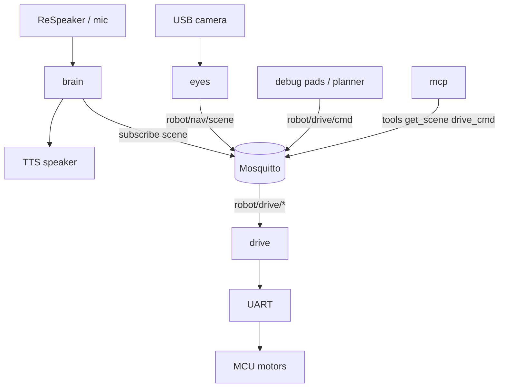

# Architecture

Puppet is split into four processes that share one MQTT bus. Each owns a hardware or product concern so they can restart and scale GPU/CPU independently on the Jetson.

## Body map

```text
  eyes     see the room          → publish robot/nav/scene
  drive    move the base         → robot/drive/cmd|stop|status
  brain    talk with the child   → subscribe scene; inject Vision: into Gemma
  mcp      tools for Cursor/agents → mirror MQTT (optional motion gate)
```



## Responsibilities

### eyes
- Capture camera frames.
- Run YOLO (objects), Depth Anything V2 Metric (meters), Fast-SCNN (floor-ish labels).
- Fuse into a traversability mask, BEV costmap, and a short `hint`.
- Publish JSON on `robot/nav/scene`.
- Debug UI: `eyes/debug_web` (camera / boxes / traverse + drive pad).

### drive
- Host MQTT bridge → UART protocol.
- Firmware owns FIFO, watchdog TTL, and estop latch.
- Debug UI: `drive/debug_web` (or the pad embedded in eyes).

### brain
- Voice orchestrator (Parakeet STT, llama.cpp Gemma, Piper TTS).
- When `mqtt.vision_enabled` is true, subscribes to `robot/nav/scene` and appends a `Vision:` line to the LLM system prompt.
- Does **not** command motors yet (persona says it cannot drive alone).

### mcp
- Thin stdio MCP server for Cursor / agents.
- Tools: `get_scene`, `get_drive_status`, `drive_stop`, `drive_clear`, `drive_cmd` (motion gated by `ROBOT_MCP_ALLOW_MOTION=1`).
- Never replaces Mosquitto; publishers remain eyes and drive.

## Typical bring-up order

1. `mosquitto` (system service).
2. `drive` host bridge (MCU on UART).
3. `eyes` debug web or DeepStream pipeline with scene publish.
4. `brain` (`puppet --config config/`) if voice is needed.
5. `mcp` only when an IDE/agent should inspect or nudge the robot.

## Out of scope (for now)

- Local nav planner that writes `robot/drive/cmd` from the costmap.
- ADE / indoor-trained floor segmentation (Cityscapes Fast-SCNN is a stopgap).
- Gemma tool-calling into drive.

## Build ingredients (not products)

Top-level trees such as `llama-cpp/`, `parakeet-cpp/`, `whisper-cpp/`, `tts/`, `PrismML-Eng/` are vendor/build sources used by **brain**. Prefer treating them as deps, not peer modules.
